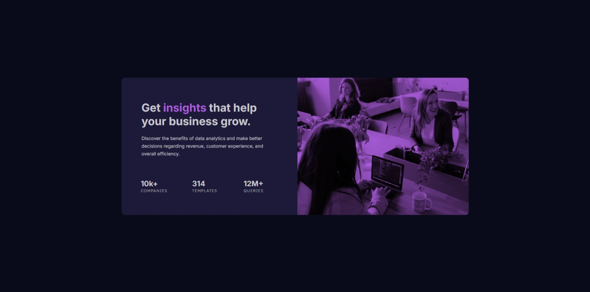

# Frontend Mentor - Stats preview card component solution

This is a solution to the [Stats preview card component challenge on Frontend Mentor](https://www.frontendmentor.io/challenges/stats-preview-card-component-8JqbgoU62). Frontend Mentor challenges help you improve your coding skills by building realistic projects. 

## Table of contents

- [Overview](#overview)
  - [The challenge](#the-challenge)
  - [Screenshot](#screenshot)
  - [Links](#links)
- [My process](#my-process)
  - [Built with](#built-with)
  - [What I learned](#what-i-learned)
  - [Continued development](#continued-development)
  - [Useful resources](#useful-resources)
  - [AI Collaboration](#ai-collaboration)
- [Author](#author)
- [Acknowledgments](#acknowledgments)

## Overview

### Screenshot



### Links

- Solution URL: [Frontend Mentor Solution](https://www.frontendmentor.io/solutions/stats-preview-card-component-09kJOmllEI)
- Live Site URL: [Stats Preview Card Component Site](https://osmond20.github.io/Stats-Preview-Card-Component/)

## My process

### Built with

- Semantic HTML5 markup
- CSS custom properties
- Flexbox
- CSS Grid
- Mobile-first workflow
- SASS

### What I learned

I learned how to blend the background color with an image which I found cool to implement

To see how you can add code snippets, see below:

```css
.image-container {
  height: 15rem;
  width: 100%;
  border-top-left-radius: 0.625rem;
  border-top-right-radius: 0.625rem;
  background-color: var(--purple-500-accent);
  background-image: url("images/image-header-mobile.jpg");
  background-size: cover;
  background-position: center;
  background-blend-mode: multiply;
}
```

### Continued development

Will be focusing on getting better at responsive design, using flexbox and grid combined and trying code further solutions as close to the design as possible using PerfectPixel

### Useful resources

- [Background blending](https://developer.mozilla.org/en-US/docs/Web/CSS/Reference/Properties/background-blend-mode) - Helped with information on grasping how blend the color and the background.

## Author

- Website - [Github](https://www.github.com/osmond20)
- Frontend Mentor - [@yourusername](https://www.frontendmentor.io/profile/osmond20)
